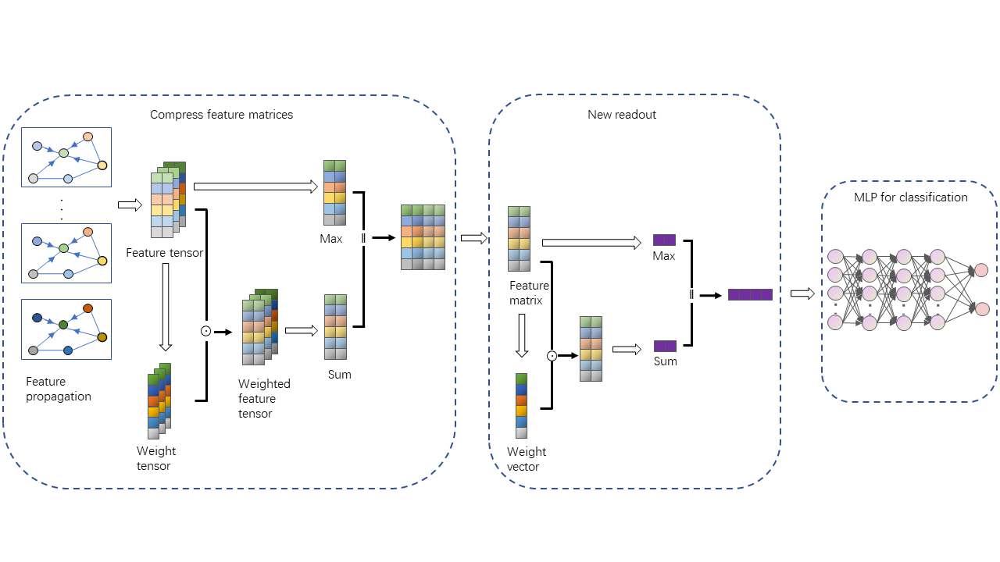
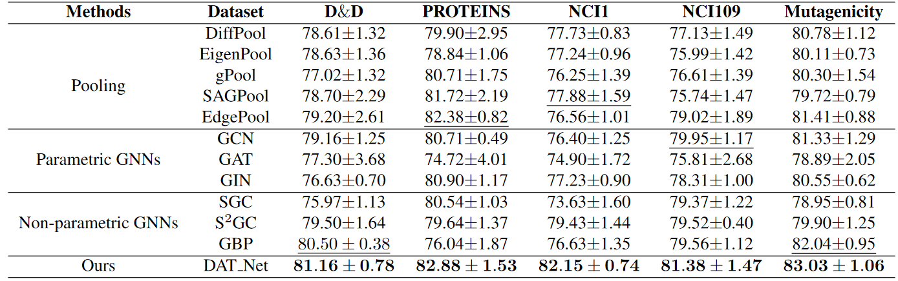

## DAT: Scalable Graph Classification with Double Attention Mechanism

### Requirements

Environments: Intel(R) Core(TM) i7-8750H （CPU）16GB(RAM), NVIDIA GEFORCE GTX 1060 GPU, Windows 11 (OS).

The PyTorch version we use is torch 1.7.1+cu100. Please refer to the official website -- https://pytorch.org/get-started/locally/ -- for detailed installation instructions.

To install all the requirements:

```setup
pip install -r requirements.txt
```


### DAT Evaluation

To reproduce the results of DAT on the graph classification task, please run the following transcript:

train.py
 

### Frame of DAT:



### Results of graph classification:


